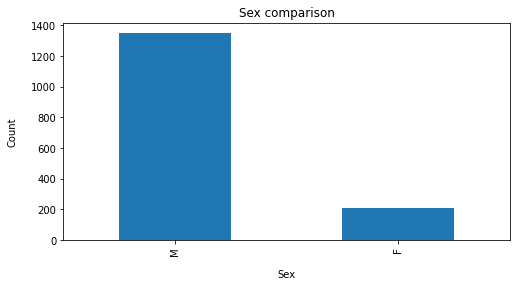
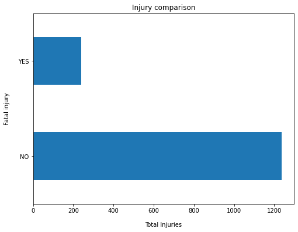
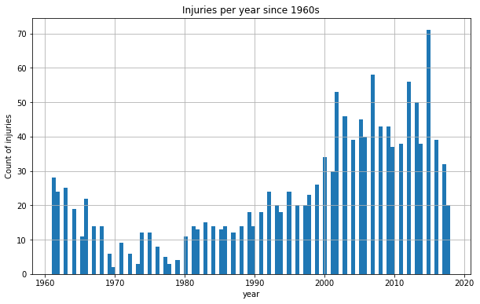

# Global-Sharks
*Humans are not on the menu of sharks. Sharks bite humans out of curiosity or to defend themselves.*

### :nut_and_bolt: **Deployment**
#### :key: Prerequisites
1. To have installed `conda`
2. To have installed `git`

#### :one: Installation instructions
The installation process is the next:
  1. Clone this repository
  2. Execute in the terminal
   
   `conda env create -n sharks -f environment.yaml`


#### :file_folder: **Folder structure**
```
└── Global-Sharks
    ├── .gitignore
    ├── environment.yaml
    ├── README.md
    ├── data
    │   ├── attacks.csv
    ├── 
    │   
    └── nb
        ├── DataCleaning-sharks.ipynb
```


### :computer: **Technology stack**
In this case, the technologies used are based on Python.

- :bar_chart: The libraries included are the ones needed for DataCleaning : Pandas, Numpy, Matplotlib.

- The system is standalone.

------
### :boom: **Analysis developed**
The analysis made include the several steps for data cleaning
1. Erase missing values (~ 18000 rows)
2. Incorrect data types
3. Duplicate rows
4. Handling missing values
5. Standardization
6. Normalization
7. Verification & enrichment of the data
   

----
### :pushpin: **Some insights**








---

----


####


### :shit: **ToDo**
1. Improve insights
2. Improve data cleaning 
